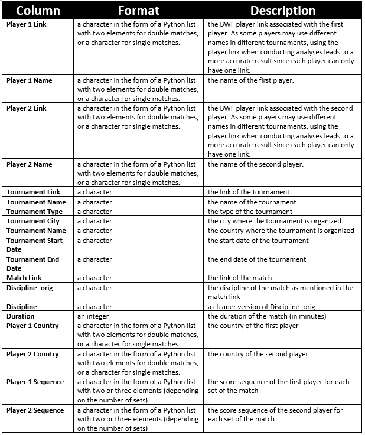
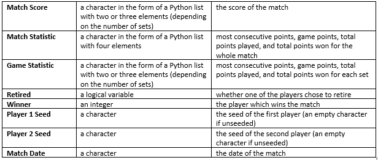

<style>
body {
text-align: justify}
</style>

```{r setup, include=FALSE}
knitr::opts_chunk$set(echo = TRUE)
```

## 1. Introduction
Badminton is a racquet sport whereby players take turn in hitting a shuttlecock across a net. There are 5 (five) disciplines in badminton, namely Men's Singles (MS), Women's Singles (WS), Men's Doubles (MD), Women's Doubles (WD) and Mixed Doubles (XD). The scoring system for all these disciplines is the same; each set begins with a score of 0-0, and the player who wins each rally gets an additional 1 (one) point. The first player who reaches 21 points wins this set. In the case where the score is 20-20, a two-point gap is needed for a player to win the set. The only exception is that when the score is 29-29, the player who obtains the next point wins the set. After completing a set, the players take a brief rest before continuing to the next set. The first player to win 2 (two) sets wins the match (this means a badminton match consists of either 2 (two) or 3 (three) sets). In a match where one player feels unfit to continue (e.g. due to an injury), she can opt to retire and her opponent wins the match.

The Badminton World Federation (BWF) is the internationally recognized governing body of this sport with the main responsibility of organizing badminton tournaments each year (also known as season). There were 125 non-continental individual tournaments organized in the 2018 season, consisting of the following (in descending order of prestigiousness): BWF World Championships (1 tournament), BWF World Tour Finals (1 tournament), BWF World Tour Super 1000 (3 tournaments), BWF World Tour Super 750 (5 tournaments), BWF World Tour Super 500 (7 tournaments), BWF World Tour Super 300 (11 tournaments), BWF World Tour Super 100 (11 tournaments), BWF International Challenge (22 tournaments), BWF International Series (37 tournaments) and BWF Future Series (27 tournaments). In addition, there are 10 tournaments categorized as Continental Championships where only players from the respective continents are eligible to participate. 

The BWF implements a ranking system called the BWF World Ranking which is used to determine the qualification for entry as well as seeding for BWF tournaments. Players are ranked based on the total points obtained from the tournaments participated in the past 52 weeks. The points a player gets for each tournament depends on 2 (two) aspects, namely the prestigiousness of the tournament and the final result of that player in that particular tournament. The BWF World Ranking is updated weekly.

The statistic for each match is available online via bwf.tournamentsoftware.com. We realize that the data available on this website are very rich, yet no one (as far as we know) has properly analyzed and summarized them into meaningful and interesting insights. For example, Chou Tien Chen (an MS player from Chinese Taipei) has been regarded by some commentators as a three-set specialist, i.e. someone who wins a lot of his matches in 3 (three) sets. It would be a good idea to check the validity of this statement. One way of doing so is to consider all MS players and compute the percentage of matches won in 3 (three) sets over all matches won. Not only does this allow us to verify these commentators' claim, but this also gives us information about the players who tend to win their matches in 3 (three) sets, an insight we have never seen before. Another example is Kento Momota, the World Number 1 MS player from Japan. Badminton lovers should know how he likes to suddenly increase the pace of his game, often resulting in a series of consecutive points. We may be interested in knowing whether he is indeed the player with the most number of consecutive points on average. Another more general topic which is equally interesting is about the duration of the matches. While we may be sure that WD matches are usually longer than MD matches, we may not be certain whether MS matches are longer than WS matches. Using the data we collected, we should be able to perform such analyses.

In summary, the questions we are interested in answering are:

1. How does set duration vary across discipline, tournament level and country?
2. Which countries are dominant in each discipline in terms of the percentage of matches won?
3. Which countries are dominant in each tournament level in terms of the number of titles won?
4. Which players have the highest winning percentages?
5. Which players tend to win their matches in two (three) sets?
6. Which players are good at utilizing momentum in their matches?
7. Which players play the longest sets?
8. Who are the comeback kings and queens of badminton; and who are the comeback victims?
9. Which players are the rising stars in 2018?
10. Who are the pairs of players with the most number of encounters in 2018?
11. Is there any relationship between the variables we have analyzed before?

#### Glossary
Before we proceed further, we would like to introduce several useful acronyms used throughout this report.

Tournament Disciplines: \
MS = Men's Singles \
Ws = Women's Singles \
MD = Men's Doubles \
WD = Women's Doubles \
XD = Mixed Doubles \

Tournament Levels (in ascending order of prestige): \
Continental = Continental Championship Tournaments \
IS + IC = International Series + International Challenge Tournaments \
Super100 = Super100 Tournaments \
Super300 = Super300 Tournaments \
Super500 = Super500 Tournmanets \
Super750 = Super750 Tournaments \
WC + WTF + Super1000 = World Championship, World Tour Finals, and Super1000 Tournaments \

 
## 2. Data Sources
The data are obtained by scraping the bwf.tournamentsoftware.com website using Beautiful Soup. The Python code we wrote to generate the .csv file can be found in the Github repository. The data set contains 16,293 observations and 27 variables which can be summarized as follows:
 


  
The following considerations and assumptions are noted:

1. We exclude matches without score sequence, match statistics or game statistics. We observe that such matches are usually part of smaller tournaments participated by low-ranked (semi-professional) players. Hence, this exclusion will not affect the goal of our analyses.

2. We exclude junior and senior tournaments. This is because these tournaments are not part of the BWF season.

3. Some pairs in MD, WD and XD consist of players from different countries. In calculating statistics which are aggregated by country, we follow the general convention of assigning the value 0.5 for each country represented.

4. As we focus our analysis on professional badminton matches, we decide to categorize the tournaments into 7 (seven) new categories, namely (1) Grade 1 Individual Tournaments, HSBC BWF World Tour Finals and HSBC BWF World Tour Super 1000; (2) HSBC BWF World Tour Super 750; (3) HSBC BWF World Tour Super 500; (4) HSBC BWF World Tour Super 300; (5) BWF Tour Super 100; (6) Continental Individual Championships; (7) International Series and International Challenge. We exclude tournaments of other categories as they are typically participated by low-ranked (semi-professional) players.

5. Some planned matches are not played when one of the players decides to withdraw from the match. We exclude such matches from our analysis.

## 3. Data Transformation
We perform several steps of data transformation and subsetting that are essential to help make our analysis easier and more accurate.

Loading the libraries
```{r message=FALSE, warning=FALSE}
library(plyr)
library(tidyverse)
library(ggplot2)
library(extracat)
library(lubridate)
library(stringr)
library(gsubfn)
library(parcoords)
```


Loading the data
```{r}
data <- read.csv('data_2018.csv', stringsAsFactors=FALSE, encoding = "UTF-8")
```

1. Convert string of dates into a date format
```{r}
data <- data %>%
  mutate(Tournament.Start.Date = as.Date(Tournament.Start.Date, format='%m/%d/%Y'))
data <- data %>%
  mutate(Tournament.End.Date = as.Date(Tournament.End.Date, format='%m/%d/%Y')) 
data <- data %>%
  mutate(Match.Date = as.Date(Match.Date, format='%m/%d/%Y'))
```
 
2. Convert non-standard seed (e.g. '16-Sep', which should be 9/16) by taking the rounded mean of the two numbers (e.g. 9/16 becomes 13); convert every seed into integer
```{r}
data$Player.1.Seed <- mapvalues(data$Player.1.Seed, 
          from = c('16-Sep', '8-May', '4-Mar'), 
          to = c(13, 7, 4))
data <- data %>% mutate(Player.1.Seed = as.integer(Player.1.Seed))

data$Player.2.Seed <- mapvalues(data$Player.2.Seed, 
          from = c('16-Sep', '8-May', '4-Mar'), 
          to = c(13, 7, 4))
data <- data %>% mutate(Player.2.Seed = as.integer(Player.2.Seed))
```

3. Exclude junior and senior tournaments
```{r}
data <- data %>%
  filter(Discipline %in% c('MD', 'WD', 'XD', 'MS', 'WS')) 
```

4. Only tournaments of the aforementioned categories are considered
```{r}
data <- data %>%
  filter(Tournament.Type %in% c('Grade 1 Individual Tournaments',
                                'HSBC BWF World Tour Finals',
                                'HSBC BWF World Tour Super 1000',
                                'HSBC BWF World Tour Super 750',
                                'HSBC BWF World Tour Super 500',
                                'HSBC BWF World Tour Super 300',
                                'BWF Tour Super 100',
                                'Continental Individual Championships',
                                'International Series',
                                'International Challenge')) 

data$Tournament.Type <- mapvalues(data$Tournament.Type, 
          from = c('Grade 1 Individual Tournaments',
                  'HSBC BWF World Tour Finals',
                  'HSBC BWF World Tour Super 1000',
                  'HSBC BWF World Tour Super 750',
                  'HSBC BWF World Tour Super 500',
                  'HSBC BWF World Tour Super 300',
                  'BWF Tour Super 100',
                  'Continental Individual Championships',
                  'International Series',
                  'International Challenge'), 
          to = c('WC + WTF + Super 1000', 
                 'WC + WTF + Super 1000', 
                 'WC + WTF + Super 1000',
                 'Super 750',
                 'Super 500',
                 'Super 300',
                 'Super 100',
                 'Continental',
                 'IS + IC',
                 'IS + IC')) 
```

## 4. Missing Values
```{r}
colSums(is.na(data))
```

```{r}
visna(data, sort = "b")
```

By looking at these summaries, we observe that only columns **Duration**, **Player.1.Seed** and **Player.2.Seed** have missing values. The columns **Player.1.Seed** and **Player.2.Seed** have a lot of missing values primarily due to the large number of unseeded players in comparison to the seeded ones.

The row patterns are also unsurprising because matches can happen with 4 scenarios: 
1.Both players are unseeded
2.Player1 seeded vs Player2 unseeded
3.Player1 unseeded vs Player2 seeded
4.Both players are seeded

Now, Let us look at the tournament names and types corresponding to the matches with missing **Duration**

```{r}
data %>%
  filter(is.na(Duration)) %>%
  select(Tournament.Name, Tournament.Type)
```

We can see that out of the 4 (four) matches with missing **Duration**, 3 (three) of them are matches from the Turkey International 2018, and the rest is from YONEX Estonian International 2018. Both tournaments belong to the least prestigious International Series and International Challenges category.

We decide to still include these matches as the other columns are not missing. We will just remove these matches when doing analyses about match duration. Also, since the number of matches with missing values are negligible as compared to the total number of matches, any way of handling the missing values will not result in a significant difference in our overall insights.

## 5. Results

### 5a. Summary Statistics

Before answering the questions, we will first provide some basic statistics about the data in order to gain a better understanding of it.

1. Number of matches by discipline
```{r}
summary1 <- data %>%
  group_by(Discipline) %>%
  summarize(count = n())

ggplot(summary1, aes(fct_reorder(Discipline, -count), count)) +
  geom_bar(stat = 'identity', fill = '#730099') +
  ggtitle('Number of Matches by Discipline') +
  xlab('Discipline') +
  ylab('Number of matches') +
  theme_gray(16) + 
  theme(plot.title = element_text(hjust = 0.5))
```

From this plot, we can observe that both Men's and Women's Single matches occur more frequently than its Double counterparts in 2018. 

2. Number of unique players by discipline
```{r}
players1 <- data %>%
  select(Player.1.Name, Discipline)
colnames(players1) <- c('Player.Name', 'Discipline')
players2 <- data %>%
  select(Player.2.Name, Discipline)
colnames(players2) <- c('Player.Name', 'Discipline')

players <- rbind(players1, players2)

summary2 <- players %>%
  group_by(Discipline) %>%
  summarize(count = n_distinct(Player.Name))

ggplot(summary2, aes(fct_reorder(Discipline, -count), count)) +
  geom_bar(stat = 'identity', fill = '#4D4DFF') +
  ggtitle('Number of Unique Players by Discipline') +
  theme_gray(16) +
  xlab('Discipline') +
  ylab('Number of unique players') +
  
  theme(plot.title = element_text(hjust = 0.5))
```

From this plot, we can observe the distribution of unique players across disciplines in 2018 with MS having the highest number of unique players. Note that the order in this plot differs from that in the previous plot. Interestingly, WS has the least number of unique player which implies that, on average, WS players tend to play more match as compared to players in other disciplines. 

3. Number of tournaments by categories
```{r}
summary3 <- data %>%
  group_by(Tournament.Type) %>%
  summarize(count = n_distinct(Tournament.Name))

ggplot(summary3, aes(Tournament.Type, count)) +
  geom_bar(stat = 'identity', fill = '#1AFF1A') +
  ggtitle('Number of Tournaments by Category') +
  xlab('Tournament Type') +
  ylab('Number of tournaments') +
  theme_gray(16) + 
  theme(plot.title = element_text(hjust = 0.5)) +
  theme(axis.text.x = element_text(angle = 20, hjust = 1))
```

Note: Due to missing data, several IS + IC tournaments have been excluded from the data which does not reflect the true number of The number of IS + IC tournaments.

This plot describes the distribution of tournaments across 2018 where we can observe that, in general, the number of tournaments that occur decreases as prestige increases. One exception to this trend is the Continental tournaments which occur less frequently due to its regional specificity.


4. Number of tournaments throughout 2018
```{r}
ntr <- data %>%
  mutate(week_number = week(Tournament.End.Date)) %>%
  group_by(week_number) %>%
  summarize(count = n_distinct(Tournament.Name))

all_week <- data.frame(matrix(ncol = 1, nrow = 52))
colnames(all_week) <- c('week_number')
all_week$week_number <- seq(1,52)

ntr <- merge(x = all_week, y = ntr, by = 'week_number', all.x = TRUE) %>%
  mutate(count = ifelse(is.na(count), 0, count)) %>%
  mutate(date = ymd('2018-01-01') + weeks(week_number - 1))  

ggplot(ntr, aes(date, count)) + 
  geom_line(color = 'blue') +  
  ggtitle('Number of Tournaments per Week in 2018') +
  xlab('Week') +
  ylab('Tournament count') +
  theme_grey(16) +
  theme(plot.title = element_text(hjust = 0.5))
```

From this plot, we can observe the number of tournaments played in various weeks across 2018. In general, majority of the tournaments were held in Quarter 4 of 2018, with the World Tour Finals (WTF) occuring on Dec 12th - Dec 16th 2018. 

5. Density plot of matches duration per discipline
```{r}
ggplot(data) +
  geom_density(mapping = aes(x = Duration, fill = Discipline), alpha = 
                 0.5) +
  ggtitle('Density Plot of Match Duration per Discipline') +
  xlab('Duration') +
  ylab('Density') +
  theme_gray(16) +
  theme(plot.title = element_text(hjust = 0.5))
```

From this plot, we can observe that the match duration densities does not vary sigificantly across disciplines. Moreover, all these density plots tend to be right-skewed with WD and WS densities having slightly heavier-tail as compared to other disciplines. 

6. Percentage of retired matches per discipline
```{r}
summary4 <- data %>%
  group_by(Discipline) %>%
  summarize(count = n(), retired = sum(Retired)) %>%
  mutate(pct_retired = 100 * retired/count)

ggplot(summary4, aes(fct_reorder(Discipline, -pct_retired), pct_retired)) +
  geom_bar(stat = 'identity', fill = '#4D4DFF') +
  ggtitle('Percentage of Retired Matches per Discipline') +
  xlab('Discipline') +
  ylab('Percentage of retired matches') +
  theme_gray(16) +
  theme(plot.title = element_text(hjust = 0.5)) 
```

From this plot, we can observe that retirements tend to happen more frequently in Single matches as compared to Double matches possibly due to the physically demanding nature of Single matches. 

### 5b. Analysis of Matches, Players, Tournaments

In this part, we will revisit the questions we posed earlier and try to answer them one by one.

**1. How does set duration vary across discipline, tournament level and country?**

We are interested in studying the set duration of a badminton match, i.e. the total duration of the match divided by the number of sets in the match. First, we want to know whether set duration varies across discipline. We hypothesize that WD and MS matches usually have longer sets as the players tend to play longer rallies, whereas MD and XD matches usually have shorter sets as the players tend to play shorter and more attacking rallies. The following bar chart displays the mean set duration per discipline.

```{r}
data2 <- data
data2 <- data2 %>%
  mutate(Number.Of.Set = (str_count(Match.Score, ',') + 1)/2,
         Duration.Per.Set = Duration/Number.Of.Set) %>%
  filter(Retired == FALSE & !is.na(Duration)) 
  #consider only matches where Retired = FALSE with available Duration
 
graph1 <- data2 %>% 
  group_by(Discipline) %>% 
  summarize(mean_duration = mean(Duration.Per.Set))

ggplot(graph1, aes(fct_reorder(Discipline, -mean_duration), mean_duration)) +
  geom_bar(stat = 'identity', fill = '#4D4DFF') +
  ggtitle('Set Duration per Discipline') +
  xlab('Discipline') +
  ylab('Mean set duration') +
  theme_gray(16) + 
  theme(plot.title = element_text(hjust = 0.5)) 
```

From the chart above, we can see that the average set durations for WD and MS are quite similar, and are larger than those for WS, MD and XD. This corroborates our hypothesis. Also, we observe that the set durations for WS, MD and XD matches are quite similar.

The next sub-question pertains to whether set duration varies across tournament level. We hypothesize that larger tournaments have longer set durations as larger tournaments are typically participated by better players who tend to produce longer and more breathtaking rallies (see https://www.youtube.com/watch?v=kVyE-HAcWaE for example). Also, we guess that the ordering WD > MS > WS > MD > XD is preserved throughout tournament level. The following bar chart displays the mean set duration per discipline and tournament level.

```{r}
graph2 <- data2 %>% 
  group_by(Discipline, Tournament.Type) %>% 
  summarize(mean_duration = mean(Duration.Per.Set))

#relevel
graph2 <- graph2 %>% 
  group_by(Tournament.Type) %>%
  arrange(Tournament.Type, -mean_duration) %>%
  unite('temp', Tournament.Type, Discipline, sep = '_', remove = FALSE) %>%
  data.frame() %>%
  mutate(temp = factor(temp, levels = temp))
 
graph2 %>%
  group_by(Tournament.Type) %>%
  ggplot(aes(x = temp, y = mean_duration, fill = Discipline)) +
  geom_bar(stat = 'identity') +
  facet_wrap(~Tournament.Type, scales = 'free') +
  scale_x_discrete(breaks = graph2$temp, labels = graph2$Discipline) +
  ggtitle('Set Duration per Discipline and Tournament Level') +
  xlab('Discipline') +
  ylab('Mean set duration') +
  theme(plot.title = element_text(hjust = 0.5)) +
  theme(legend.position = "none")
```

This plot clearly shows that MS, WD and WS sets are on average the longest (in the same order) for each tournament type. XD sets are the shortest for each tournament type with the expection of Super 500 and WTF + Super 1000. However, in both cases, the average duration for XD and MD sets are approximately the same. These show that the ordering WD > MS > WS > MD > XD is largely preserved. With regard to the other hypothesis, we observe that the higher the tournament level, the longer the average duration of sets.

In order to verify the last claim, let us compute the average set duration per tournament level.

```{r}
graph2 %>%
  group_by(Tournament.Type) %>%
  summarize(Mean.Duration = mean(mean_duration)) %>%
  as.data.frame()
```

From the data frame above, we can see that larger tournaments are associated with longer set durations, with the exception of the WC + WTF + Super 1000 category which are expected to have a longer average duration as compared to the Super 750 category. We exclude Continental tournaments from this analysis as there is no level associated with these tournaments.

Our last sub-question is related to whether set duration varies across country. We hypothesize that this result may be strongly tied to the typical playing style of players from each country. Defensive players tend to play longer sets, while attacking players tend to play shorter sets. The following Cleveland dot plot displays the mean set duration per discipline and country (we only take the top 10 countries for each discipline).

```{r}
data3_1 <- data2 %>% 
  select(Player.1.Country, Discipline, Duration.Per.Set)
colnames(data3_1) <- c('Player.Country', 'Discipline', 'Duration.Per.Set')
data3_2 <- data2 %>% 
  select(Player.2.Country, Discipline, Duration.Per.Set)
colnames(data3_2) <- c('Player.Country', 'Discipline', 'Duration.Per.Set')
data3 <- rbind(data3_1, data3_2)

data4 <- data.frame(matrix(ncol = 4, nrow = 0))
colnames(data4) <- c('Player.Country', 'Discipline', 'Duration.Per.Set', 'Weight')

for(i in 1:nrow(data3)){
  if(str_count(data3[i,1], "]") == 0){
    data4[nrow(data4)+1, ] <- c(data3[i,], 1)
  } else {
    splitted <- strsplit(data3[i,1], "'")[[1]]
    country1 <- splitted[2]
    country2 <- splitted[4]
    data4[nrow(data4)+1, ] <- 
      c(country1, data3[i,2], data3[i,3], 0.5)
    data4[nrow(data4)+1, ] <- 
      c(country2, data3[i,2], data3[i,3], 0.5)
  }
}

data4 <- data4 %>%
  mutate(Duration.Per.Set = as.numeric(Duration.Per.Set),
         Weight = as.numeric(Weight))

graph3 <- data4 %>%
  group_by(Discipline, Player.Country) %>%
  summarize(mean_duration = 
              weighted.mean(Duration.Per.Set, Weight)) %>%
  top_n(10, wt=mean_duration)

#relevel
graph3 <- graph3 %>% 
  group_by(Discipline) %>%
  arrange(Discipline, mean_duration) %>%
  unite('temp', Discipline, Player.Country, sep = '_', remove = 
          FALSE) %>%
  data.frame() %>%
  mutate(temp = factor(temp, levels = temp))
 
graph3 %>%
  group_by(Discipline) %>%
  ggplot(aes(x = temp, y = mean_duration)) +
  geom_point() +
  facet_wrap(~Discipline, scales = 'free_y') +
  coord_flip() +
  scale_x_discrete(breaks = graph3$temp, labels = 
                     graph3$Player.Country) +
  ggtitle('Set Duration per Discipline and Country') +
  xlab('Country') +
  ylab('Mean set duration') +
  theme(plot.title = element_text(hjust = 0.5)) 
```

We can see that Japan appears on top for each discipline (except for XD, where it ranks third). A possible explanation is Japanese players' tendency to play more defensively as compared to other countries' players, thus resulting in longer set durations. In comparison, as Indonesian players tend to play offensively, their average match durations are not as long. It is also interesting to see that the countries included in the dot plot are mostly countries with decent badminton players. A possible explanation is better players tend to be involved in longer sets as they have better retrieving skills.

**2. Which countries are dominant in each discipline in terms of the percentage of matches won?** 

This question is very intuitive. The idea is to rank each country based on the percentage of matches won per discipline. We hypothesize that countries which are on the top for a particular discipline are those with many high-ranked players in that discipline. The following Cleveland dot plot visualizes what we aim to answer (we only take the top 10 countries for each discipline).

```{r}
data5 <- data
data6_1 <- data5 %>% 
  select(Player.1.Country, Discipline, Winner) %>%
  mutate(Winner = ifelse(Winner == 1, 1, 0))
colnames(data6_1) <- c('Player.Country', 'Discipline', 'Winner')

data6_2 <- data5 %>% 
  select(Player.2.Country, Discipline, Winner) %>%
  mutate(Winner = ifelse(Winner == 2, 1, 0))
colnames(data6_2) <- c('Player.Country', 'Discipline', 'Winner')

data6 <- rbind(data6_1, data6_2)

data7 <- data.frame(matrix(ncol = 4, nrow = 0))
colnames(data7) <- c('Player.Country', 'Discipline', 'Winner', 'Weight')

for(i in 1:nrow(data6)){
  if(str_count(data6[i,1], "]") == 0){
    data7[nrow(data7)+1, ] <- c(data6[i,], 1)
  } else {
    splitted <- strsplit(data6[i,1], "'")[[1]]
    country1 <- splitted[2]
    country2 <- splitted[4]
    data7[nrow(data7)+1, ] <- 
      c(country1, data6[i,2], data6[i,3], 0.5)
    data7[nrow(data7)+1, ] <- 
      c(country2, data6[i,2], data6[i,3], 0.5)
  }
}

data7 <- data7 %>%
  mutate(Winner = as.numeric(Winner),
         Weight = as.numeric(Weight)) 

graph4 <- data7 %>%
  group_by(Discipline, Player.Country) %>%
  summarize(winner_rate = 100*weighted.mean(Winner, Weight),
            count = n()) %>%
  filter(count > 100) %>% #only consider (discipline, country) pairs with at least 100 matches
  top_n(10, wt=winner_rate)

#relevel
graph4 <- graph4 %>% 
  group_by(Discipline) %>%
  arrange(Discipline, winner_rate) %>%
  unite('temp', Discipline, Player.Country, sep = '_', remove = FALSE) %>%
  data.frame() %>%
  mutate(temp = factor(temp, levels = temp))
 
graph4 %>%
  group_by(Discipline) %>%
  ggplot(aes(x = temp, y = winner_rate)) +
  geom_point() +
  facet_wrap(~Discipline, scales = 'free_y') +
  coord_flip() +
  scale_x_discrete(breaks = graph4$temp, labels = 
                     graph4$Player.Country) +
  ggtitle('Percentage of Wins per Discipline and Country') +
  xlab('Country') +
  ylab('Percentage of wins') +
  theme(plot.title = element_text(hjust = 0.5)) 
```
 
From this plot, we can see that China has the highest winning percentage for MS, WS, XD, which makes a lot of sense as China has a lot of high-ranked players in each discipline (e.g. Shi Yu Qi, Chen Long and Lin Dan for MS). Also, the countries that consistently have high rankings for all disciplines are China, Japan, Korea, Malaysia and Denmark, and all of them tend to have strong players in all disciplines. While Indonesia ranks quite high on MD, MS and XD (even ranks first on MD), it ranks low on WS and WD. This is clearly supported by the lack of high-ranked players in both disciplines, something which has been brought into attention numerous times by former Indonesian badminton legends.

One thing which may be counterintuitive is the fact Bulgaria ranks first in WD, surpassing Japan which is known to have at least 3 (three) players in the Top 5. A possible reason is the participation of a decent Bulgarian pair, Gabriela Stoeva/Stefani Stoeva, in multiple lower level tournaments, which results in a lot of 'easy' wins for the pair. This is not uncommon in badminton, where some players choose to play in 'easy' tournaments to obtain enough points which guarantees their qualification for some prestigious tournaments.

**3. Which countries are dominant in each tournament level in terms of the number of titles won?**

This question is again very intuitive. Instead of looking at the percentage of matches won, we now look at the number of tournaments won per tournament level. What we are interested in knowing is whether the dominance of some countries is evident for each tournament level. The following bar chart shows the number of tournament wins by country per tournament level.

```{r fig.height = 8, fig.width = 10}
data17 <- data %>%
  filter(Match.Date == Tournament.End.Date) 

#only three tournaments (Austrian, Welsh, Polish) have semi-final matches on the last day of the tournament. we decide to hard-code those.
data18 <- data %>%
  filter(Match.Date == Tournament.End.Date) 
data18 <- data18 %>%
  filter(!Tournament.Name %in%
                   c('Austrian Open 2018',
                     'VICTOR Welsh International 2018',
                     'Polish International 2018'))

data19_1 <- data18 %>% 
  select(Player.1.Country, Tournament.Type, Winner)
colnames(data19_1) <- c('Player.Country', 'Tournament.Type', 'Winner')
data19_1 <- data19_1 %>%
  mutate(Winner = ifelse(Winner == 1, 1, 0))

data19_2 <- data18 %>% 
  select(Player.2.Country, Tournament.Type, Winner)
colnames(data19_2) <- c('Player.Country', 'Tournament.Type', 'Winner')
data19_2 <- data19_2 %>%
  mutate(Winner = ifelse(Winner == 2, 1, 0))

data19 <- rbind(data19_1, data19_2)
data19 <- data19 %>%
  filter(Winner == 1)
data19 <- data19 %>%
  select(Player.Country, Tournament.Type) 

data20 <- data.frame(matrix(ncol = 3, nrow = 0))
colnames(data20) <- c('Player.Country', 'Tournament.Type', 'Weight')

for(i in 1:nrow(data19)){
  if(str_count(data19[i,1], "]") == 0){
    data20[nrow(data20)+1, ] <- c(data19[i,], 1)
  } else {
    splitted <- strsplit(data19[i,1], "'")[[1]]
    country1 <- splitted[2]
    country2 <- splitted[4]
    data20[nrow(data20)+1, ] <- 
      c(country1, data19[i,2], 0.5)
    data20[nrow(data20)+1, ] <- 
      c(country2, data19[i,2], 0.5)
  }
}

#hardcode for 3 tournaments
data20[nrow(data20)+1, ] <- c('India', 'IS + IC', 1)
data20[nrow(data20)+1, ] <- c('Denmark', 'IS + IC', 1)
data20[nrow(data20)+1, ] <- c('Chinese Taipei', 'IS + IC', 1)
data20[nrow(data20)+1, ] <- c('Japan', 'IS + IC', 1)
data20[nrow(data20)+1, ] <- c('Russia', 'IS + IC', 1)
data20[nrow(data20)+1, ] <- c('Spain', 'IS + IC', 1)
data20[nrow(data20)+1, ] <- c('Spain', 'IS + IC', 1)
data20[nrow(data20)+1, ] <- c('England', 'IS + IC', 1)
data20[nrow(data20)+1, ] <- c('England', 'IS + IC', 1)
data20[nrow(data20)+1, ] <- c('Scotland', 'IS + IC', 1)
data20[nrow(data20)+1, ] <- c('Germany', 'IS + IC', 1)
data20[nrow(data20)+1, ] <- c('India', 'IS + IC', 1)
data20[nrow(data20)+1, ] <- c('Chinese Taipei', 'IS + IC', 1)
data20[nrow(data20)+1, ] <- c('Japan', 'IS + IC', 1)
data20[nrow(data20)+1, ] <- c('Czech Republic', 'IS + IC', 1)

data20 <- data20 %>%
  mutate(Weight = as.numeric(Weight))

graph8 <- data20 %>%
  group_by(Tournament.Type, Player.Country) %>%
  summarize(total_win = sum(Weight)) %>%
  top_n(10, wt = total_win)

#relevel
graph8 <- graph8 %>% 
  group_by(Tournament.Type) %>%
  arrange(Tournament.Type, total_win) %>%
  unite('temp', Tournament.Type, Player.Country, sep = '_', 
        remove = FALSE) %>%
  data.frame() %>%
  mutate(temp = factor(temp, levels = temp))
 
graph8 %>%
  group_by(Tournament.Type) %>%
  ggplot(aes(x = temp, y = total_win, fill = Player.Country)) +
  geom_bar(stat = 'identity') +
  facet_wrap(~Tournament.Type, scales = 'free_y') +
  coord_flip() +
  scale_x_discrete(breaks = graph8$temp, labels = 
                     graph8$Player.Country) +
  ggtitle('Number of Wins by Country per Tournament Level') +
  xlab('Country') +
  ylab('Number of tournaments won') +
  theme(plot.title = element_text(hjust = 0.5)) +
  theme(legend.position = "none") 
```

A quick glance on the bar chart suggests that Japan has the highest number of tournament wins for each tournament type except IS + IC (where it ranks second after Denmark). China tends to have a high number of wins in each tournament level other than IS + IC. This reflects the Chinese national team's approach which prefers to let the less experienced players compete nationally first before allowing them to participate in Super 100 events. This is different from the approach adopted by most of other countries, whereby most professional players start their career journey from participating in IS + IC events.

In addition, we also find that only 7 countries have won the highest level tournaments. In general, as tournaments become more competitive, the number of countries which have won them tend to decrease.

Now, let us switch our focus to player-specific analyses.

**4. Which players have the highest winning percentages?**

For this question, we are interested in the players with the highest winning percentage per discipline. A reasonable hypothesis is that high-ranked players tend to have the highest winning percentages. However, we will see in a moment that there is an extent to which this statement does not exactly hold. The following Cleveland dot plot shows the top 7 (seven) players with the highest percentage of wins per discipline.

```{r}
data21_1 <- data %>% 
  select(Player.1.Name, Discipline, Winner)
colnames(data21_1) <- c('Player.Name', 'Discipline', 'Winner')
data21_1 <- data21_1 %>%
  mutate(Winner = ifelse(Winner == 1, 1, 0))

data21_2 <- data %>% 
  select(Player.2.Name, Discipline, Winner)
colnames(data21_2) <- c('Player.Name', 'Discipline', 'Winner')
data21_2 <- data21_2 %>%
  mutate(Winner = ifelse(Winner == 2, 1, 0))

data21 <- rbind(data21_1, data21_2)

graph9 <- data21 %>%
  group_by(Discipline, Player.Name) %>%
  summarize(percent_win = 100*mean(Winner), count = n()) %>%
  filter(count > 30) %>% #only consider players who have played at least 30 matches
  top_n(7, wt=percent_win)

ggplot(graph9, aes(x=percent_win, 
                   y=reorder(Player.Name, percent_win))) +
  geom_point(color='blue') +  
  facet_wrap(~Discipline, scales = 'free_y', nrow=3) +
  xlab('Percentage of wins') +
  ylab('Player name') +
  ggtitle('Players with the Highest Percentage of Wins') +  
  theme(plot.title = element_text(hjust = 0.5)) 
   
```

Overall, we see that three players stood out, namely Gideon/Sukamuljo (INA), Zheng/Huang (CHN) and Momota (JPN). These players happen to be the number 1 ranked players at the end of 2018. However, when we perform the analysis for each discipline, some unfamiliar names like Victor Svendsen, Ade Resky Dwicahyo and Peter Kaesbauer-Olga Konon appear. A possible explanation is that these players tend to participate in tournaments in which they are one of the best participants, which give them a higher chance of winning over their opponents. Putting this aside, we see that the majority of the players whose names are included in the dot plot are high-ranked players, which support our hypothesis.
  
**5. Which players tend to win their matches in two (three) sets?**

This question is very interesting. As mentioned in the introduction, we have seen a number of commentators dubbing Chou Tien Chen, a Chinese Taipei MS player, as a three-set specialist. This means out of all matches which he won, a large percentage of them are won in 3 (three) sets. Two direct generalized questions arise: who are the players with the highest percentage of three-set wins over all wins; and who are the players with the highest percentage of two-set wins over all wins? We have the answers below in the form of Cleveland dot plots (we only take the top 7 players for each discipline). 

```{r}
data22 <- data
data22 <- data22 %>%
  mutate(Number.Of.Set = (str_count(Match.Score, ',') + 1)/2) %>%
  mutate(Duration.Per.Set = Duration/Number.Of.Set) 

#only consider matches where Retired = FALSE
data22 <- data22 %>%
  filter(Retired == FALSE)
data23_1 <- data22 %>% 
  select(Player.1.Name, Discipline, Winner, Number.Of.Set)
colnames(data23_1) <- c('Player.Name', 'Discipline', 'Winner', 'Number.Of.Set')
data23_1 <- data23_1 %>%
  mutate(Winner = ifelse(Winner == 1, 1, 0))
data23_2 <- data22 %>% 
  select(Player.2.Name, Discipline, Winner, Number.Of.Set)
colnames(data23_2) <- c('Player.Name', 'Discipline', 'Winner', 'Number.Of.Set')
data23_2 <- data23_2 %>%
  mutate(Winner = ifelse(Winner == 2, 1, 0))

data23 <- rbind(data23_1, data23_2)
data23 <- data23 %>%
  filter(Winner == 1) %>%
  select(Player.Name, Discipline, Number.Of.Set) %>%
  mutate(Two.Set = ifelse(Number.Of.Set == 2, 1, 0)) %>%
  select(Player.Name, Discipline, Two.Set)
  
graph11 <- data23 %>%
  group_by(Discipline, Player.Name) %>%
  summarize(percent_twoset = 100*mean(Two.Set), count = n()) %>%
  filter(count > 20) %>% #only consider players who have won at least 20 matches
  top_n(7, wt=percent_twoset)

ggplot(graph11, aes(x=percent_twoset, 
                   y=reorder(Player.Name, percent_twoset))) +
  geom_point(color='blue') +  
  facet_wrap(~Discipline, scales = 'free_y', nrow=3) +
  xlab('Percentage of two-set wins') +
  ylab('Player name') +
  ggtitle('Percentage of Two-Set Wins (Highest to Lowest)') +  
  theme(plot.title = element_text(hjust = 0.5))  
``` 

```{r}
data22 <- data
data22 <- data22 %>%
  mutate(Number.Of.Set = (str_count(Match.Score, ',') + 1)/2) %>%
  mutate(Duration.Per.Set = Duration/Number.Of.Set) 

#only consider matches where Retired = FALSE
data22 <- data22 %>%
  filter(Retired == FALSE)
data23_1 <- data22 %>% 
  select(Player.1.Name, Discipline, Winner, Number.Of.Set)
colnames(data23_1) <- c('Player.Name', 'Discipline', 'Winner', 'Number.Of.Set')
data23_1 <- data23_1 %>%
  mutate(Winner = ifelse(Winner == 1, 1, 0))
data23_2 <- data22 %>% 
  select(Player.2.Name, Discipline, Winner, Number.Of.Set)
colnames(data23_2) <- c('Player.Name', 'Discipline', 'Winner', 'Number.Of.Set')
data23_2 <- data23_2 %>%
  mutate(Winner = ifelse(Winner == 2, 1, 0))

data23 <- rbind(data23_1, data23_2)
data23 <- data23 %>%
  filter(Winner == 1) %>%
  select(Player.Name, Discipline, Number.Of.Set) %>%
  mutate(Two.Set = ifelse(Number.Of.Set == 2, 1, 0)) %>%
  select(Player.Name, Discipline, Two.Set)
  
graph11 <- data23 %>%
  group_by(Discipline, Player.Name) %>%
  summarize(percent_twoset = 100*mean(Two.Set), count = n()) %>%
  filter(count > 20) %>% #only consider players who have won at least 20 matches
  top_n(7, wt=-percent_twoset)

ggplot(graph11, aes(x=percent_twoset, 
                   y=reorder(Player.Name, -percent_twoset))) +
  geom_point(color='blue') +  
  facet_wrap(~Discipline, scales = 'free_y', nrow=3) +
  xlab('Percentage of two-set wins') +
  ylab('Player name') +
  ggtitle('Percentage of Two-Set Wins (Lowest to Highest)') +  
  theme(plot.title = element_text(hjust = 0.5))  
``` 

From these two dot plots, we can see that the percentage of two-set wins (out of all wins) does not correlate with the players' overall performance or winning records. The players with more than 90 per cent of two-set wins are Akbar Bintang Cahyono-Moh Reza Pahlevi Isfahani, Takeshi Kamura-Keigo Sonoda, Tontowi Ahmad-Liliyana Natsir, Michelle Skodstrup and Line Hojmark Kjaersfeldt. Out of these players, only Kamura-Sonoda and Ahmad-Natsir are in the top 10 ranking for their respective disciplines. 

An interesting insight is that despite not being a top-ranked player, Michelle Skodstrup wins almost all of her matches in two sets, and she happens to have one of the highest percentage of wins among all WS players. The same explanation may apply here, in which she tends to play in lower level tournaments against players who are generally weaker than her in terms of skills and experience.

Looking at the second plot, we see that the only player whose percentage of two-set wins is lower than 50 per cent (i.e. percentage of three-set wins is higher than 50 per cent) is the USA's Beiwen Zhang. Also, observe that we do not see Chou Tien Chen's name here. It turns out that he is the eleventh on the list, which is why his name is shown in the dot plot. Although he wins a significant portion of his matches in 3 (three) sets, we do not think the statistic is enough to dub him as a three-set specialist!

**6. Which players are good at utilizing momentum in their matches?**

In badminton, it is not unusual to see players scoring more than 8 (eight) consecutive points in a set, sometimes resulting in a dramatic win. An example is during the last set of Kento Momota vs Viktor Axelsen's match, where Axelsen's hope of winning the set after leading 16-6 was crushed as Kento regained his momentum and won the set with a score of 21-18. The ability to stay focus on the game regardless of the score gap is one vital key that differentiates top-ranked players from lower-ranked players. Throughout his career, Kento Momota has been an extremely consistent player who almost never loses his focus at any point of his matches. 

For this question, we are particularly interested in players who are good at utilizing momentum in their matches, which is measured by the average most consecutive points in their matches. The following Cleveland dot plot shows the player with the highest number of maximum consecutive points.

```{r}
data26 <- data %>%
  filter(Retired == FALSE)
  
first_cp <- function(x){
  t <- gsubfn(".", list("[" = "", "]" = "", "'" = ""), x)
  return(as.integer(strsplit(t,',')[[1]][1]))
}

second_cp <- function(x){
  t <- gsubfn(".", list("[" = "", "]" = "", "'" = ""), x)
  return(as.integer(strsplit(t,',')[[1]][2]))
}

data26 <- data26 %>%
  mutate(first_mcp = first_cp(Match.Statistic),
         second_mcp = second_cp(Match.Statistic)) 
```

```{r}
data27_1 <- data26 %>% 
  select(Player.1.Name, Player.1.Country, first_mcp, Discipline)
colnames(data27_1) <- c('Player.Name', 'Player.Country', 'MCP', 'Discipline')
data27_2 <- data26 %>% 
  select(Player.2.Name, Player.2.Country, second_mcp, Discipline)
colnames(data27_2) <- c('Player.Name', 'Player.Country', 'MCP', 'Discipline')
data27 <- rbind(data27_1, data27_2)

graph14 <- data27 %>%
  group_by(Discipline, Player.Name) %>%
  summarize(mean_mcp = mean(MCP), count = n()) %>%
  filter(count > 30) %>% #only consider players who have played at least 30 matches
  top_n(7, wt=mean_mcp)

ggplot(graph14, aes(x=mean_mcp, 
                   y=reorder(Player.Name, mean_mcp))) +
  geom_point(color='blue') +  
  facet_wrap(~Discipline, scales = 'free_y', nrow=3) +
  xlab('Average maximum consecutive points') +
  ylab('Player name') +
  ggtitle('Average Maximum Consecutive Points') +  
  theme(plot.title = element_text(hjust = 0.5)) 
```

Overall, we see that the players who score the most consecutive points on average are Marcus Fernaldi Gideon-Kevin Sanjaya Sukamuljo, Tontowi Ahmad-Liliyana Natsir, Viktor Axelsen and Tai Tzu Ying. All of them are top 3 (three) players in their respective disciplines. It is surprising to notice that Kento Momota's name is not on the list, yet Viktor Axelsen's name is on the top! 

Another insight we obtain is that the names on the plot are generally top-ranked players, which corroborate our previous discussion that top-ranked players are generally able to regain their momentum when they want to do so.

**7. Which players play the longest sets?**

For this question, we are interested in knowing the players whose average set durations are the longest. Our hypothesis is that defensive players tend to play longer sets as they are more likely to retrieve and less likely to attack, hence resulting in longer rallies in general. To see whether our hypothesis checks out, let us look at the Cleveland dot plot below. We only include the top 7 (seven) players per discipline.

```{r}
data24 <- data
data24 <- data24 %>%
  mutate(Number.Of.Set = (str_count(Match.Score, ',') + 1)/2) %>%
  mutate(Duration.Per.Set = Duration/Number.Of.Set)

# only consider matches where Retired = FALSE with available duration
data24 <- data24 %>%
  filter(Retired == FALSE & !is.na(Duration))

data25_1 <- data24 %>% 
  select(Player.1.Name, Discipline, Duration.Per.Set)
colnames(data25_1) <- c('Player.Name', 'Discipline', 'Duration.Per.Set')
data25_2 <- data24 %>% 
  select(Player.2.Name, Discipline, Duration.Per.Set)
colnames(data25_2) <- c('Player.Name', 'Discipline', 'Duration.Per.Set')

data25 <- rbind(data25_1, data25_2)

graph13 <- data25 %>%
  group_by(Discipline, Player.Name) %>%
  summarize(mean_duration = mean(Duration.Per.Set), count = n()) %>%
  filter(count > 30) %>% #only consider players who have played at least 30 matches
  top_n(7, wt=mean_duration)

ggplot(graph13, aes(x=mean_duration, 
                   y=reorder(Player.Name, mean_duration))) +
  geom_point(color='blue') +  
  facet_wrap(~Discipline, scales = 'free_y', nrow=3) +
  xlab('Average duration of sets') +
  ylab('Player name') +
  ggtitle('Average Duration of Sets') +  
  theme(plot.title = element_text(hjust = 0.5)) 
```

From this plot, it looks that our hypothesis partially checks out. For example, the top 4 (four) players in MS are known to be defensive players, especially Chen Long (a lot of players have expressed how good Chen's defense is, including the one and only Lin Dan who said that "playing against Chen Long is like playing against a wall"). However, the seventh name on the list in Anthony Sinisuka Ginting, who is known to be very attacking in his play. In WD, we see a lot of Japanese pairs on the list, which may be closely related to the Japanese defensive playing style. One thing which may validate our hypothesis is the lack of Indonesian players, who are attacking players in general, on the list.

**8. Who are the comeback kings and queens of badminton; and who are the comeback victims?**

In badminton and maybe other sports, comebacks are not uncommon. They are a clear proof that anything can happen if you believe in your ability and maintain your focus while you are still in the match. An example of a great comeback can be seen in https://www.youtube.com/watch?v=ygoM31uaiAY, where Ratchanok Intanon managed to win the final set 21-18 against Carolina Marin after being 11-18 down, earning her the title "Queen of Comeback". For this question, we are going to analyze players who have been the kings and queens of comebacks. Equally interesting are the players who have been the victims of these comebacks. 

One thing to note is that defining a comeback is hard (or even harder than executing the comeback itself!) If you were 11-18 down and won the match 21-18, clearly it is a comeback. What if you were 15-18 down? 16-18 down? 17-18 down? This illustrates the difficulty of mathematically defining the elements needed for a comeback. For this question, we are going to use an alternative definition (which thus may not be all-encompassing). Instead of looking at the points, we just look at the sets; given a match between two players ***x*** and ***y***, we say ***x*** is a comeback king (or queen) if ***x*** loses the first set, but wins the other two (and consequently the match). Also, ***y*** becomes the comeback victim.

The following Cleveland dot plot shows the top 5 players for each discipline who have been the comeback kings and queens according to our simplified definition.

```{r}
data30 <- data %>%
  filter(Retired == FALSE)
  
comeback <- function(match_score){
  if(str_count(match_score, ',') < 5){
    return(0)
  } else {
    match_score <- gsubfn(".", list("[" = "", "]" = "", "'" = ""), 
                          match_score)
    match_score <- strsplit(match_score,',')[[1]]
    s1 <- as.integer(match_score[1])
    s2 <- as.integer(match_score[2])
    s3 <- as.integer(match_score[3])
    s4 <- as.integer(match_score[4])
    s5 <- as.integer(match_score[5])
    s6 <- as.integer(match_score[6])
    if(s1<s2 & s3>s4 & s5>s6){
      return(1)
    } else if(s1>s2 & s3<s4 & s5<s6){
      return(2)
    } else {
      return(0) 
    }
   }
}

data30['Comeback'] <- unlist(lapply(data30[1:nrow(data30), 'Match.Score'], comeback))
```

```{r fig.height = 8, fig.width =10}
data31_1 <- data30 %>%
  filter(Comeback == 1) %>%
  select(Player.1.Name, Player.1.Country, Discipline)
colnames(data31_1) <- c('Player.Name', 'Player.Country', 'Discipline')
data31_2 <- data30 %>%
  filter(Comeback == 2) %>%
  select(Player.2.Name, Player.2.Country, Discipline)
colnames(data31_2) <- c('Player.Name', 'Player.Country', 'Discipline')
data31 <- rbind(data31_1, data31_2)

graph17 <- data31 %>%
  group_by(Discipline, Player.Name) %>%
  summarize(count = n()) %>%
  top_n(5, wt=count)

ggplot(graph17, aes(x=count, 
                   y=reorder(Player.Name, count))) +
  geom_point(color='blue') +  
  facet_wrap(~Discipline, scales = 'free_y', nrow=3) +
  xlab('Total comeback executors') +
  ylab('Player name') +
  ggtitle('Number of Comebacks Made ') +  
  theme(plot.title = element_text(hjust = 0.5)) 
```

In general, we can see that players who made a lot of comebacks tend to be high-ranked players (especially in MD, WD and WS where all are high-ranked players), which may mean that comebacks tend to happen in high-ranked tournaments rather than low-ranked tournaments. In WS, we see Ratchanok Intanon's name, which may explain her being crowned the "Queen of Comeback" title. 

There are two players, namely Marcus Fernaldi Gideon-Kevin Sanjaya Sukamuljo and Tai Tzu Ying, who have made more than 10 comebacks in 2018 alone. They both happen to be the number 1 in their respective disciplines.

Now, let us look at the players who have been comeback victims most frequently.
 
```{r fig.height = 8, fig.width =10}
data32_1 <- data30 %>%
  filter(Comeback == 1) %>%
  select(Player.2.Name, Player.2.Country, Discipline)
colnames(data32_1) <- c('Player.Name', 'Player.Country', 'Discipline')
data32_2 <- data30 %>%
  filter(Comeback == 2) %>%
  select(Player.1.Name, Player.1.Country, Discipline)
colnames(data32_2) <- c('Player.Name', 'Player.Country', 'Discipline')
data32 <- rbind(data32_1, data32_2)

graph18 <- data32 %>%
  group_by(Discipline, Player.Name) %>%
  summarize(count = n()) %>%
  top_n(5, wt=count)

ggplot(graph18, aes(x=count, 
                   y=reorder(Player.Name, count))) +
  geom_point(color='blue') +  
  facet_wrap(~Discipline, scales = 'free_y', nrow=3) +
  xlab('Total comeback victims') +
  ylab('Player name') +
  ggtitle('Number of Matches Lost due to Comeback') +  
  theme(plot.title = element_text(hjust = 0.5)) 
```

From this plot, we can see that the players whose names are listed here tend to be lower in rank as compared to those listed in the above dot plot. However, a closer look revealts that several players who have been comeback victims are comeback kings or queens themselves! Take Chou Tien Chen for example. He is the MS player who has been the comeback victim the most number of times, yet he ranks second as a comeback king. The exact situation happens for Chen Yu Fei. It seems that a better title for Chou is not the three-set specialist, but the king of unpredictability!

**9. Which players are the rising stars in 2018?**

One of the beauties of a sport is to see how players progress in their career. No world number 1 can stay in that position forever, and consequently there will be another player who will be the next world number 1. The top players' trajectories to become who they are now are also unique; some are quick and smooth, while some are full of ups and downs. In this question, we are interested in the number of times an unseeded player have won against a seeded player, which may be an indicator of the making of rising stars

This, however, may not always be accurate. There are many instances where top players decide to play again after several years or months or retirement. During this comeback process, they (who are now unseeded) are likely to beat seeded players. Another possible is case is during the recovery of an injury. Top players who suffer from an injury may withdraw from a lot of tournaments, which results in a significant drop in their ranks. When they become injury-free, the trail to claim their ranks back will involve beating a lot of current seeded players.

In all cases however, we can classify these 'unseeded wins' as a sign of career progression. Let us consider the following Cleveland dot plot, which lists the top 5 (five) players for each discipline.

```{r}
data28 <- data
data28 <- data28 %>%
  filter(as.numeric(is.na(Player.1.Seed)) + 
           as.numeric(is.na(Player.2.Seed)) == 1)
data29_1 <- data28 %>% 
  select(Player.1.Name, Player.1.Country, Player.1.Seed, Winner, Discipline)
data29_1 <- data29_1 %>%
  mutate(Winner = ifelse(Winner == 1, 1, 0))
colnames(data29_1) <- c('Player.Name', 'Player.Country', 'Player.Seed', 'Winner', 'Discipline')

data29_2 <- data28 %>% 
  select(Player.2.Name, Player.2.Country, Player.2.Seed, Winner, Discipline)
data29_2 <- data29_2 %>%
  mutate(Winner = ifelse(Winner == 2, 1, 0))
colnames(data29_2) <- c('Player.Name', 'Player.Country', 'Player.Seed', 'Winner', 'Discipline')
data29 <- rbind(data29_1, data29_2)
data29 <- data29 %>% 
  filter(is.na(Player.Seed) & Winner == 1)

graph19 <- data29 %>%
  group_by(Discipline, Player.Name) %>%
  summarize(count = n()) %>%
  top_n(5, wt=count)

ggplot(graph19, aes(x=count, 
                   y=reorder(Player.Name, count))) +
  geom_point(color='blue') +  
  facet_wrap(~Discipline, scales = 'free_y', nrow=3) +
  xlab('Total unseeded wins') +
  ylab('Player name') +
  ggtitle('Number of Unseeded Wins') +  
  theme(plot.title = element_text(hjust = 0.5)) 
```

From this plot, we can see that there are two unseeded players who have won against seeded players in exceptionally high numbers of occassions, namely Kento Momota and Li Xue Rui. The reason behind this is exactly what we explained previously: both players had not been playing for a long time, which resulted in a huge rank drop; once they decided to play again, they needed to play in low-level tournaments to gain enough ranking points. 

In order to differentiate which players who might be rising stars, we can delve deeper into their career records. Anthony Sinisuka Ginting, Yeo Jia Min and Kim Ga Eun may be called rising stars as they are still very young and still have a lot of room for improvement. On the other hand, Mohammad Ahsan-Hendra Setiawan and Kento Momota are the players who have experienced being in the top of the leaderboard of their respective disciplines, and their wins against unseeded players indicate they are 're-claiming' the positions in which they used to be.
 
**10. Who are the pairs of players with the most number of encounters in 2018?**

In badminton, it is common to see two players, especially top-ranked players, meeting each other numerous times during a short period of time. These frequent meetings usually make them aware of each other's strenghts, weaknesses and playing style. Sometimes one of the players wins all (or almost all) of the encounters, while most of the times their head-to-head record is relatively balanced. Head-to-head records are complex in badminton, and they largely depend on the players' playing style. For example, a top player may struggle playing with a low-ranked opponent just because her playing style is not compatible. Often, the 'real' top players are the ones who can use different playing styles when dealing with different opponents in order to increase their chances of winning. 

Let us present a Cleveland dot plot which shows the top 5 (five) players in each discipline with the most number of meetings, and their **net** head-to-head record. As expected, a lot of top players are mentioned in the figure.

```{r fig.height = 10, fig.width = 10}
data30 <- data
combine <- function(x, y){
  if(x < y){
    return(paste(x, y, sep = '&'))
  } else {
    return(paste(y, x, sep = '&'))
  }
}

data30 <- data30 %>% 
  rowwise() %>%
  mutate(combined = combine(Player.1.Name, Player.2.Name)) %>%
  mutate(winner_name = ifelse(Winner == 1, Player.1.Name, Player.2.Name)) %>%
  data.frame()

data30 <- data.frame(data30) %>%
  group_by(combined, winner_name, Discipline) %>%
  select(combined, winner_name, Discipline) %>%
  summarize(count = n()) %>%
  data.frame()

data31 <- data.frame(data30) %>% 
  group_by(combined, Discipline) %>%
  summarize(sum = sum(count)) %>%
  data.frame()

data30 <- data30 %>%
  rowwise() %>%
  mutate(weight = ifelse(substr(winner_name, 1, 10) == substr(combined, 1, 10), 1, -1)) %>%
  mutate(net = weight * count) %>%
  data.frame() %>%
  group_by(combined, Discipline) %>%
  summarize(sum_net = sum(net)) %>%
  select(combined, sum_net)

data32 <- merge(x = data30, y = data31, by = 'combined', all.x = TRUE)

flipname <- function(x, y){
  if(y >= 0){
    return(x)
  } else {
    split = strsplit(x, '&')[[1]]
    p1 = split[1]
    p2 = split[2]
    return(paste(p2, p1, sep = '&'))
  }
}

data32 <- data32 %>%
  rowwise() %>%
  mutate(new_combined = flipname(combined, sum_net),
         new_sum_net = abs(sum_net)) %>%
  data.frame() %>%
  select(new_combined, new_sum_net, sum, Discipline)

graph20 <- data32 %>%
  group_by(Discipline) %>%
  top_n(3, wt = sum) #select top 3  
 
ggplot(graph20) +
  geom_point(aes(x=sum, y=reorder(new_combined, sum), colour = 'Total meetings')) +
  geom_point(aes(x=new_sum_net, y=new_combined, colour = 'Net Head to Head')) +
  facet_wrap(~Discipline, scales = 'free_y', nrow=5) +
  xlab('') +
  ylab('Player name') +
  ggtitle('Total Meetings and Net Head to Head') + 
  theme(plot.title = element_text(hjust = 0.5)) 
```

Since this static plot is hard to interpret and, we create an interactive plot in D3 to better visualize the head to head of the pairs of player. More detail about this will be provided in the next section. 

**11. Is there any relationship between the variables we have analyzed before?**

We create a parallel coordinate plot using the following variables: player name, discipline, average set duration, average number of sets, number of matches played, number of wins, percentage of matches won. We color the lines by discipline. For each discipline, we consider the top 5 ranked players by the end of 2018.

```{r}
data33 <- data

#only consider matches where Retired = FALSE and available duration
data33 <- data %>%
   mutate(Number.Of.Set = (str_count(Match.Score, ',') + 1)/2,
          Duration.Per.Set = Duration/Number.Of.Set) %>%
  filter(Retired == FALSE & !is.na(Duration))

#select players for p1
data33_1 <- data33 %>% 
  select(Player.1.Name, Discipline, Winner, Number.Of.Set, Duration.Per.Set) %>%
  mutate(source = "p1")
colnames(data33_1) <- c('Player.Name', 'Discipline', 'Winner', 'Number.Of.Set', 'Duration.Per.Set', 'source')

#select players for p2
data33_2 <- data33 %>% 
  select(Player.2.Name, Discipline, Winner, Number.Of.Set, Duration.Per.Set) %>%
  mutate(source = "p2")
colnames(data33_2) <- c('Player.Name', 'Discipline', 'Winner', 'Number.Of.Set', 'Duration.Per.Set', 'source')


data33 <- rbind(data33_1, data33_2)

wins <- data33 %>%
  mutate(win = ifelse(substr(source,2,2) == Winner, 1, 0)) %>%
  group_by(Player.Name, Discipline) %>%
  summarise(num_played = n(), wins = sum(win)) %>%
  mutate(win_perc = wins/num_played)

graph21 <- data33 %>%
  group_by(Player.Name, Discipline) %>%
  summarise(avg_set_duration = mean(Duration.Per.Set), avg_num_set = mean(Number.Of.Set))

graph21 <- merge(graph21, wins, all.x = TRUE)

graph21 <- graph21 %>% 
  filter(Player.Name %in% c('Kento MOMOTA', 'SHI Yu Qi', 'CHOU Tien Chen', 'CHEN Long', 'SON Wan Ho', 
                            'TAI Tzu Ying', 'Nozomi OKUHARA', 'PUSARLA V. Sindhu', 'CHEN Yu Fei', 'Akane YAMAGUCHI', 
                            "['Yuki FUKUSHIMA', 'Sayaka HIROTA']","['Misaki MATSUTOMO', 'Ayaka TAKAHASHI']",
                            "['Mayu MATSUMOTO', 'Wakana NAGAHARA']", "['Greysia POLII', 'Apriyani RAHAYU']",
                            "['CHEN Qing Chen', 'JIA Yi Fan']",
                            "['ZHENG Si Wei', 'HUANG Ya Qiong']","['WANG Yi Lyu', 'HUANG Dong Ping']",
                            "['Yuta WATANABE', 'Arisa HIGASHINO']", "['Tontowi AHMAD', 'Liliyana NATSIR']",
                            "['Dechapol PUAVARANUKROH', 'Sapsiree TAERATTANACHAI']",
                            "['Marcus Fernaldi GIDEON', 'Kevin Sanjaya SUKAMULJO']", "['LI Jun Hui', 'LIU Yu Chen']", 
                            "['Takeshi KAMURA', 'Keigo SONODA']", "['CHEN Hung Ling', 'WANG Chi-Lin']",
                            "['Hiroyuki ENDO', 'Yuta WATANABE']"
                            )) %>%
  arrange(Discipline)


parcoords( graph21, 
  color = list(
    colorScale = "scaleOrdinal",
    colorBy = "Discipline",
    colorScheme = "schemeCategory10"
  ),
  withD3 = TRUE,
  reorderable = TRUE,
  brushMode = "1D-axes",
  alpha = 0.5,
  rownames = FALSE
)
```

From the parallel coordinate plots, we can see that XD matches (for the top 5 players) tend to have the lowest average set duration as compared to the other disciplines. In terms of the average set duration and average number of sets, there does not seem to be any correlation between them. In terms of the number of games played, those that have low average number of sets tend to have the higher number of games played across all disciplines. Finally, in terms of the percentage of matches won, the dominant players who are highly ranked tend to top the percentage in each discipline. 

## 6. Interactive Component
We created 4 (four) interactive plots using D3 to complement our analyses and static visualizations. The link to the website is https://jsantoso2.github.io/EDAV-Final-Project-Fall-2019/

Below is the summary of the interactive plots.

### 6a. Tree diagram
The first plot is a tree diagram which summarizes top 15 badminton players by end of 2018 for each discipline. For each player, we provide information about nationality, career win percentage, career record and career prize.

### 6b. Directed graph of head-to-head records
For each discipline, we create a directed graph whose nodes correspond to each of the top 15 players by the end of 2018. The node size corresponds to the number of wins in 2018. For each pair of player A and B, we draw a directed edge from A to B iff out of all meetings involving A and B in 2018, A has more wins than B. We draw a directed edge from B to A iff B has more wins than A. We do not draw any edge from A to B iff A and B never met in 2018 or A has the same number of wins as B. We use a darker shade for edges corresponding to net win greater than 1.

### 6c. Player count world map in 2018
For each discipline, we create a choropleth map with fill corresponding to the number of unique players representing each country. 

### 6d. Number of trophies won in 2018
For each discipline and each country (which can be double-clicked from the map in 6c), we create a bar chart of the number of trophies won by tournament level.

## 7. Conclusion
In conclusion, we have analyzed the BWF tournaments in 2018 at both the match and player level. Some of the key findings are as follows:

1. Matches for every single discipline happened more often than matches for every double discipline. In particular, MS matches happen more than twice more often than WD matches.
2. Single players are more likely to retire than double matches.
3. MS and WD sets are generally longer than MD and XD sets. This holds for every tournament type.
4. More prestigious tournaments have longer average set durations.
5. Defensive playing style (e.g. Japan) often leads to longer set durations.
6. Countries which are generally dominant in badminton include China, Japan and Korea. Some countries dominate in a certain set of disciplines (e.g. Indonesia dominates in MD, but not in WS).
7. Each country adopt a different strategy in sending its players for tournaments.
8. Some players like to play in tournaments where they are too good as compared to their opponents.
9. Top ranked players are usually good at utilizing momentum in their matches.
10. Some players deserve to earn the comeback king (queen) and comeback victim titles simultaneously (e.g. Chou Tien Chen, Chen Yu Fei).
11. Some rising stars in 2018 include Anthony Sinisuka Ginting and Yeo Jia Min.
12. Some pairs of players have met each other in multiple occassions.

The limitations of this analysis are:

1. We only considered matches data from 2018.
2. For head-to-head analysis, we only considered players ranked in the top 15 by the end of 2018.
3. We excluded matches with incomplete data. This, however, should not be a big issue since these matches typically involve less professional players.
4. The definition of comeback we use is not all-encompassing.

In the future, more research can be done on:

1. Extending the same analysis for players, matches and tournaments in 2019.
2. Players' improvement throughout their career.
3. Predictive analysis of match results based on past results. 
4. Analyzing point duration (i.e. duration per point) in addition to set duration.
5. Players who tend to win or lose their matches in deuce situations.
6. Relationship between leading in the interval (the first time one of the players wins 11 points) and leading in the game.
7. Performing more comprehensive analysis on comebacks.
8. Understanding each country's strategy in choosing tournaments their players will participate in.

The lessons learned:

1. Experience on web scraping with Python and BeautifulSoup.
2. Experience on data manipulation and static visualization in R (Ex: ggplot and other various packages)
3. Experience on creating interactive visualization using D3.
 
## 8. References
Data Sources: \
1. https://bwf.tournamentsoftware.com/  \
2. https://bwfbadminton.com/rankings/ \

D3 References (Interactive Plots): \
Tree Diagram: \
1. http://bl.ocks.org/d3noob/8375092 \

Directed Graph: \
1. https://bl.ocks.org/pkerpedjiev/f2e6ebb2532dae603de13f0606563f5b  \
2. https://stackoverflow.com/questions/28050434/introducing-arrowdirected-in-force-directed-graph-d3 \
3. http://www.coppelia.io/2014/07/an-a-to-z-of-extra-features-for-the-d3-force-layout/ \
  
Map and Map Data: \
1. https://bl.ocks.org/piwodlaiwo/73f7a0e28c53d26c04f30a754de49085 \
2. https://raw.githubusercontent.com/jdamiani27/Data-Visualization-and-D3/master/lesson4/world_countries.json \


